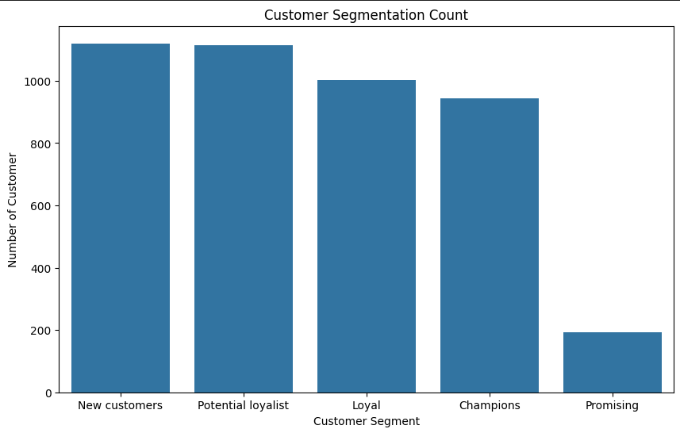
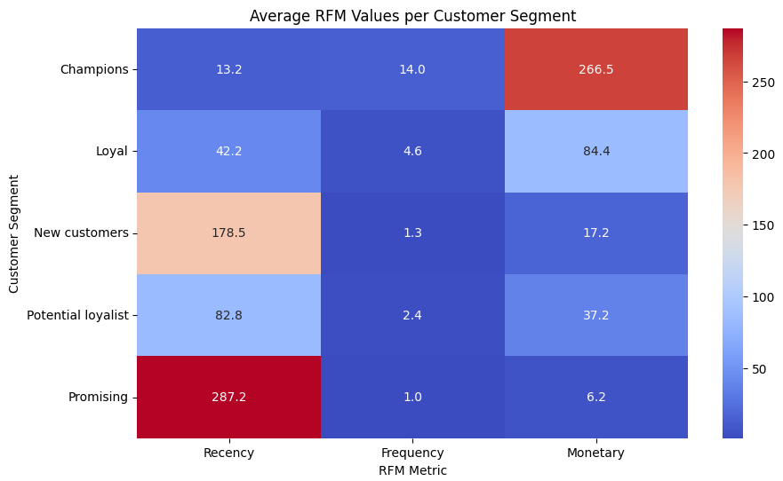

# Customer Segmentation with RFM Analysis

## Overview
A customer segmentation using Recency, Frequency, and Monetary analysis. Customers are grouped into meaningful segments, with easy marketing ideas for each, and clear charts to visualize buying behavior.

## What’s Inside

1. **RFM Score Calculation**  
   Assigns scores for:
   - **Recency**: How recently the customer purchased.
   - **Frequency**: How often they purchased.
   - **Monetary**: How much they spent.

2. **Group Similar Customers**  
   Segments customers into meaningful groups based on their RFM profiles.

3. **Marketing Suggestions**  
   Simple ideas for each group:
   - Discounts for loyal buyers.
   - Special offers for inactive customers.

4. **Visualization**  
   - Shows customer segment counts.
   - Compares average RFM values per segment.

## How to Use
- Open the notebook `online_retail_python.ipynb`.
- Follow the RFM calculation steps.
- Use the visualizations and suggestions to plan marketing strategies.

## Images

- **Customer Segments Chart:**  
  
- **Average RFM by Segment:**  
  
